# Investment Tracker

A desktop app for tracking investments in **private companies across funding rounds** —
built with PyQt6, SQLite and Matplotlib, for families and smaller investment groups who
hold illiquid, multi-round positions that a normal brokerage app can't represent.

Most portfolio tools assume public, liquid stocks with a live price. This one is built
for the opposite: a stake in a startup or fund bought across several rounds, where
"what's it worth now?" depends on the latest valuation, your ownership %, and a bit of
math (MOIC, IRR). The app keeps that history, does the math, and explains it in plain
language. All data stays **local** — nothing is sent to any server.

> **Trying it out?** This project ships with fictional demo data.
> Run `python seed_demo_data.py` to populate the app with sample companies, then launch it.
> No real financial data is included in this repository.

---

## What this project demonstrates

A real, end-to-end desktop application covering:

- **Financial modelling in code** — IRR via a numerical solver (Newton's method with a bisection fallback), plus MOIC, ROI, ownership and dilution math, with edge cases handled gracefully (single cash flow, all-positive flows, missing valuations → `n/a`).
- **Desktop GUI engineering** — a multi-panel PyQt6 interface: tree navigation, a dashboard, detail views, modal dialogs, and embedded Matplotlib charts.
- **Database design** — a normalised SQLite schema (`companies → rounds → documents`) with migrations, snapshots for change-tracking, and full CRUD.
- **Real-world data import** — parsing a messy, human-made Excel spreadsheet into clean structured records.
- **Privacy-by-design** — local-only storage, no network surface, and a `.gitignore` that keeps all real data out of version control.
- **Packaging** — a standalone PyInstaller executable so non-technical users can run it with a double-click.

---

## Who is this for

- Family investment groups and angel/syndicate investors tracking private holdings
- Anyone holding positions across **multiple funding rounds** in the same company
- People who want **IRR / MOIC / gain-loss** without building a spreadsheet by hand

If you only hold listed stocks and ETFs, a regular brokerage app will serve you better.

---

## Screenshots

**Dashboard — portfolio overview with key metrics, session delta and Portfolio Health**
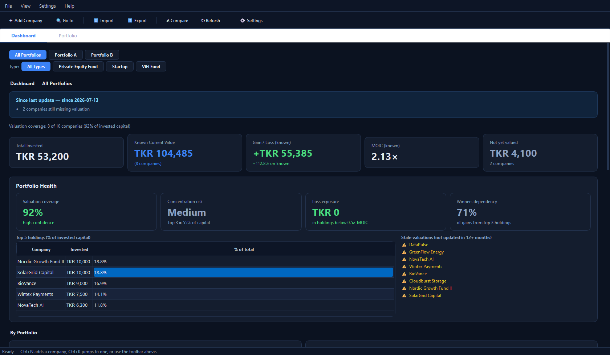

**Quick Jump (Ctrl+K) — type-ahead palette to jump straight to any company**
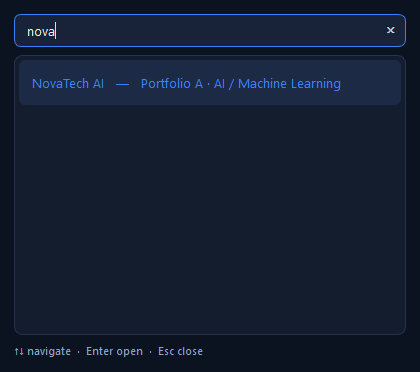

**Portfolio Health panel — valuation coverage, concentration risk, stale-valuation warnings**
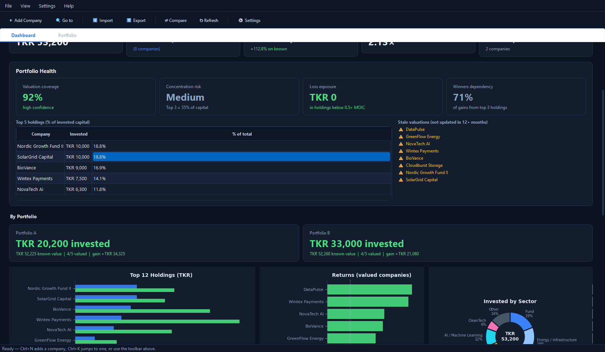

**Charts — top holdings vs. current value, MOIC per company, and sector allocation**
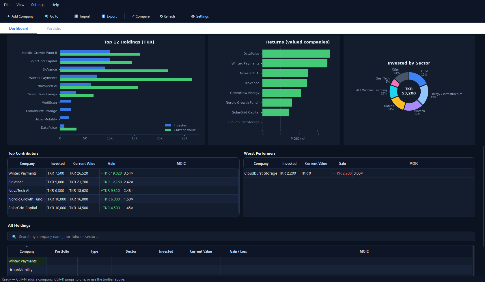

**Top contributors, worst performers and searchable full holdings table**
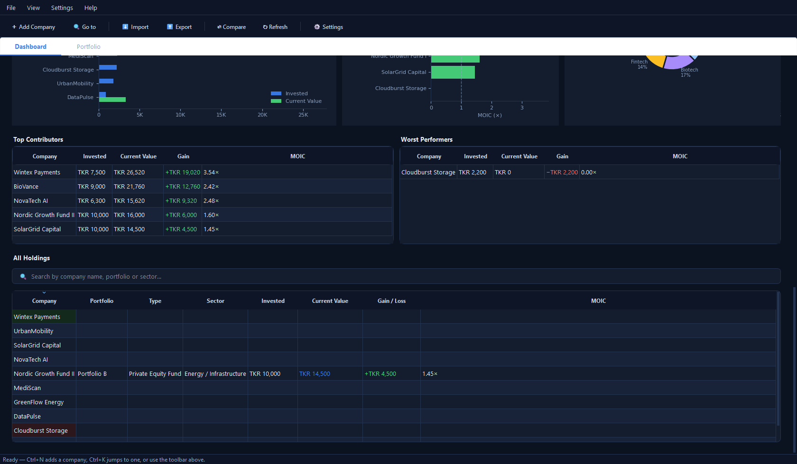

**Company detail — tabbed record (Overview / Rounds / Documents) with thesis and metrics (MOIC 3.69×, IRR 30.0%)**
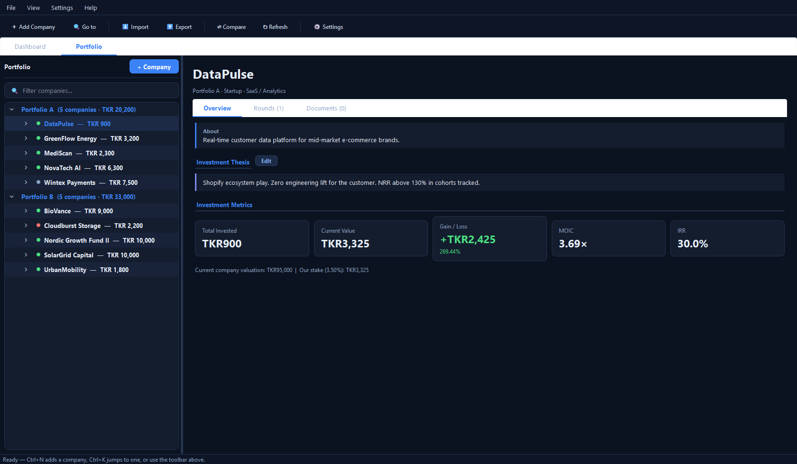

**Add company dialog — year-by-year investments, valuation and exit targets**
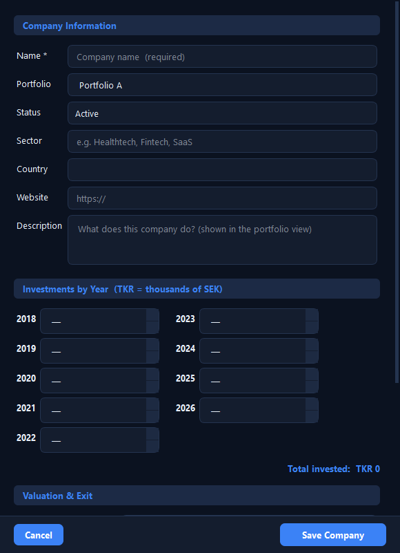

---

## Guided tour

On first launch, a stork mascot flies in and walks new users through the app —
it lands beside each key element, spotlights it, and explains it in plain language
in a speech bubble. Eight stops, under a minute, fully keyboard-navigable
(Enter/→ next, ← back, Esc exits), and it can be replayed anytime from the
**?** menu. If Windows' animation setting is off, the stork fades between stops
instead of flying. All figures below are fictional demo data.

**Welcome — the stork flies in and offers the tour**
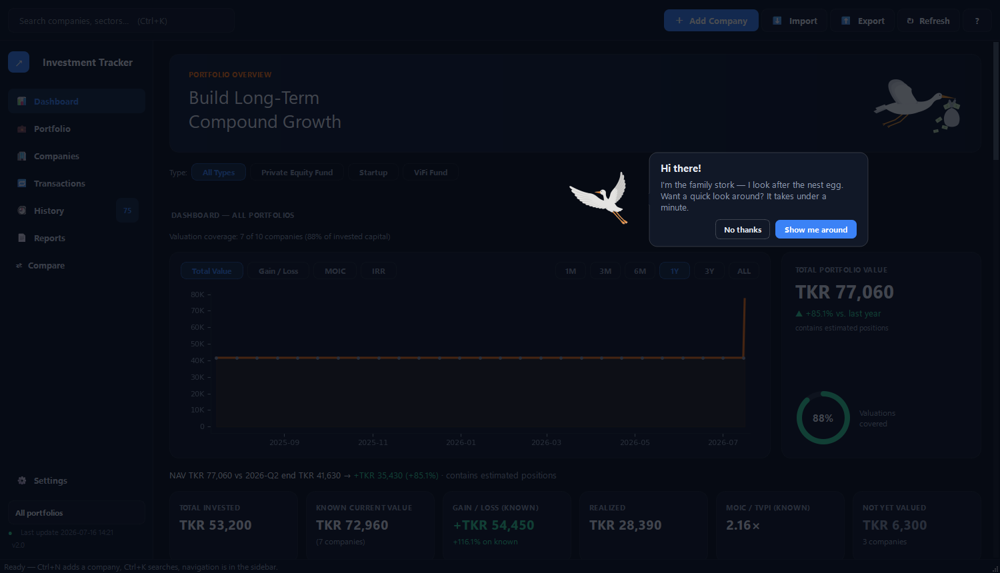

**Stop 1: Getting around — the sidebar navigation**
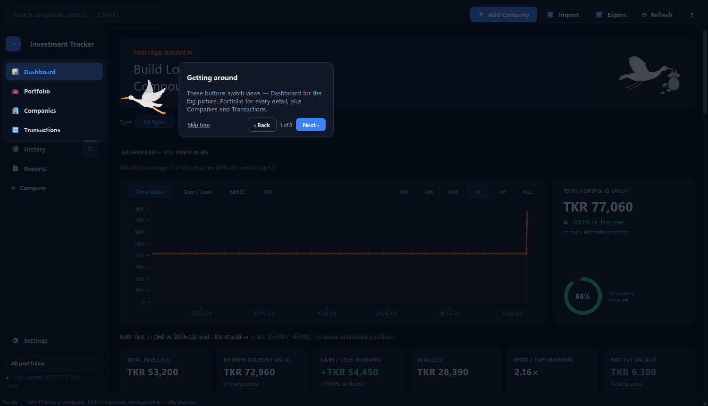

**Stop 2: Portfolio value — the value-over-time chart and its metric tabs**
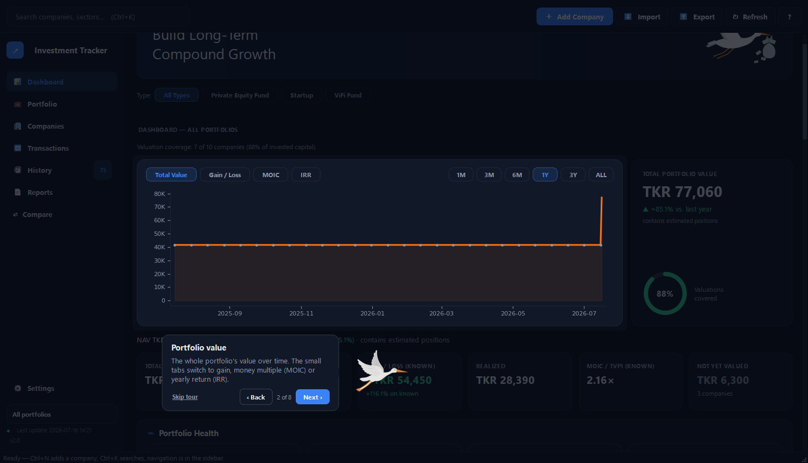

**Stop 3: The key numbers — invested, current value, gain and realized**
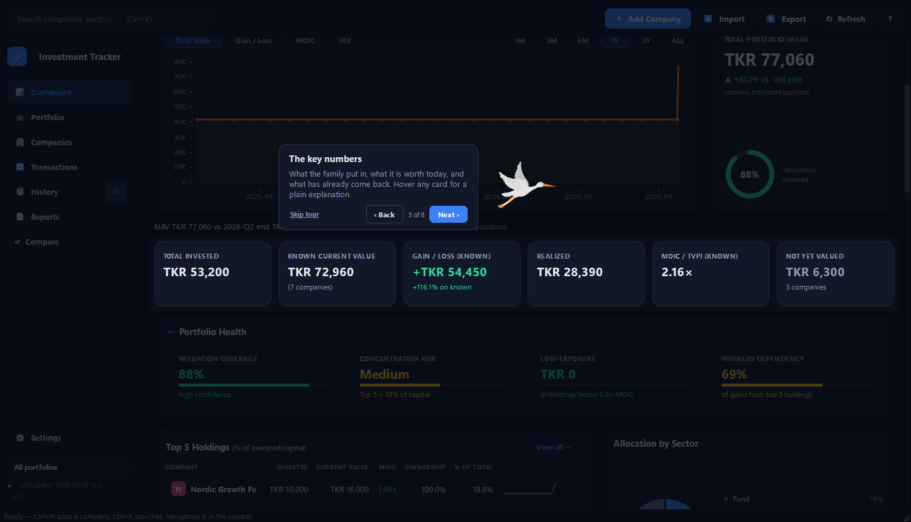

**Stop 4: Biggest holdings — the Top 5 card**
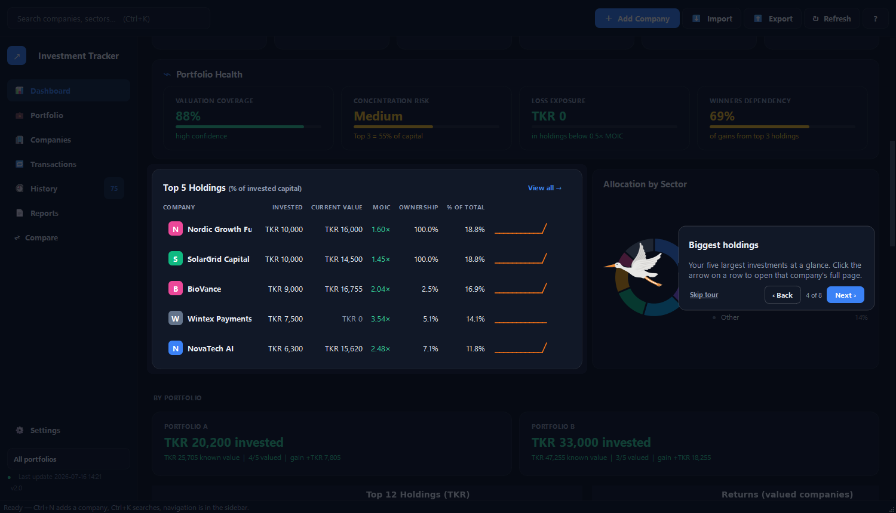

**Stop 5: Activity & alerts — recent changes and stale-valuation warnings**
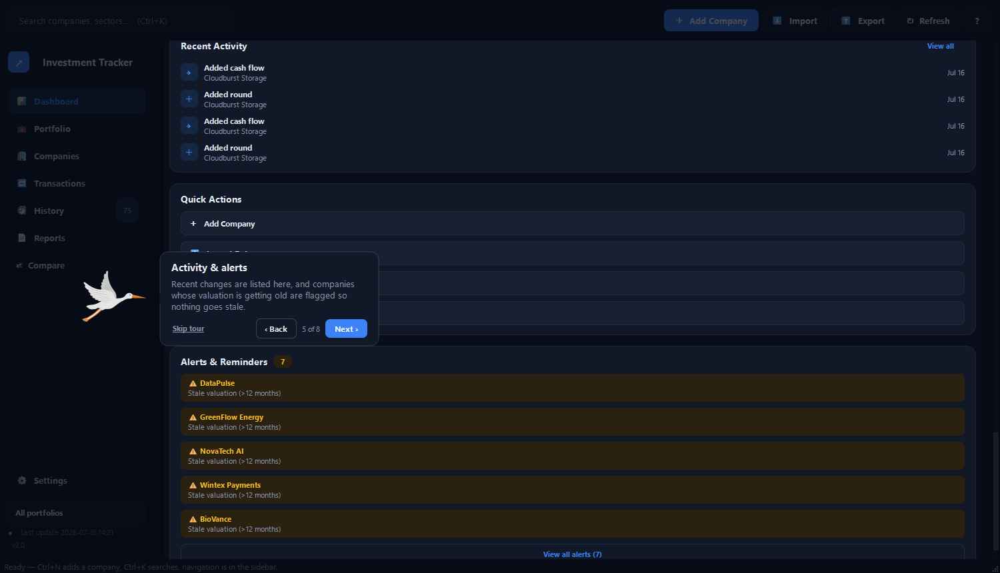

**Stop 6: Reports — PDF/web reports for a company, an owner, or the whole portfolio**
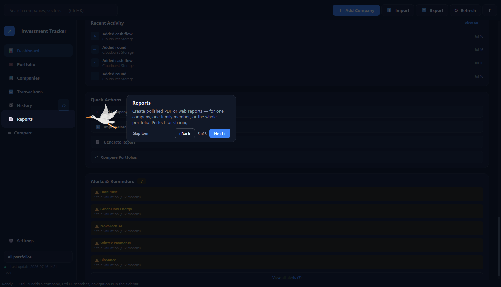

**Stop 7: Add a company — where a new investment starts**
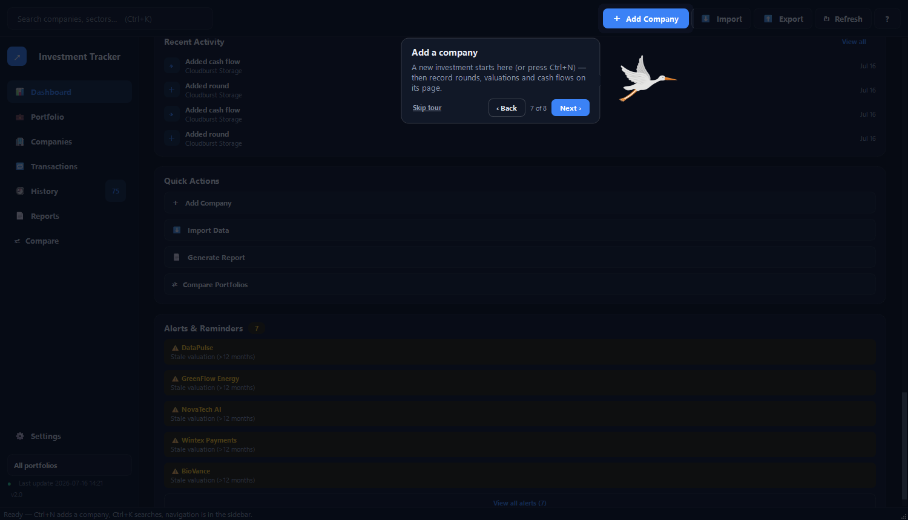

**Stop 8: AI assistant — optional and off by default; the stork points to where it lives**
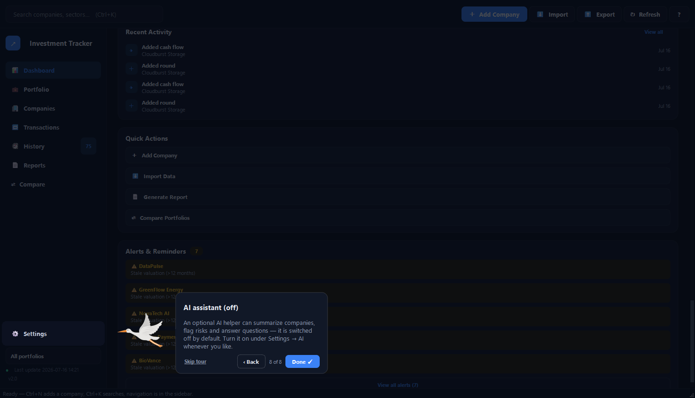

---

## Features

**Portfolio overview**
- Dashboard with total invested, current value, MOIC, IRR and gain/loss at a glance
- **Portfolio Health panel** — flags valuation coverage gaps, concentration risk, loss exposure, dependency on a few winners, and stale valuations
- **Since last update** — automatically summarises what changed (valuation moves, new documents, MOIC shift) since your last session

**Per company**
- **Tabbed company record** — Overview / Rounds / Documents, so long histories stay scannable
- Metrics, funding-round history, a valuation-progression chart and current price per share
- **Investment Thesis** note — capture *why* you invested, per company
- **Type tags** (Startup, VC Fund, Private Equity, …) with dashboard filtering by type
- **Document storage** — attach PDFs and agreements to a company or a specific round
- **Status dots** in the portfolio tree — active / exited / bankrupt at a glance

**Data in and out**
- **Excel import / export** — import from a structured spreadsheet; export back anytime
- **Portable backup** — export the whole portfolio (database + documents) as one zip to share with family

**Throughout**
- **Dark "fintech" theme** — a token-based design system (`ui/styles.py`) applied across every panel, dialog and chart
- **Quick Jump (Ctrl+K)** — type-ahead palette to open any company instantly
- Toolbar + keyboard shortcuts (Ctrl+N add company, Ctrl+R refresh, Ctrl+, settings)
- **Sector allocation donut** with CVD-safe, lightness-staggered slice colors
- Window size, splitter position and active tab are remembered between sessions
- Hover tooltips give plain-language explanations of every metric (MOIC, IRR, etc.)

---

## Tech stack

| Layer | Technology |
|---|---|
| UI | PyQt6 |
| Database | SQLite (Python `sqlite3`) |
| Charts | Matplotlib |
| Excel I/O | openpyxl |
| Packaging | PyInstaller |

---

## Getting started

### Prerequisites
- **Python 3.11+**
- Works on Windows, macOS and Linux

### Install and run

```bash
pip install -r requirements.txt
python seed_demo_data.py     # optional: load fictional sample companies
python main.py
```

On first launch the app creates an empty `investments.db`. Add a company manually, load the demo data above, or use **File → Import** to load a spreadsheet (see *Excel import*).

### Build a standalone executable

For family members who don't have Python installed, build a double-click app:

```bash
pip install pyinstaller
pyinstaller --onefile --windowed --name "InvestmentTracker" main.py
```

The executable appears in `dist/`. Build on the OS you're targeting — a Windows `.exe` must be built on Windows, a macOS app on macOS.

---

## How the metrics work

- **MOIC** (Multiple on Invested Capital) = current value ÷ total invested — e.g. `2.4×`
- **ROI** = (current value − invested) ÷ invested, as a %
- **IRR** = annualised return based on the *dates* of each investment and the current value, so timing matters (money in early and up a lot beats the same gain over a decade)
- **Current value** = your ownership % × the company's latest entered valuation

Valuations are entered manually — the app doesn't fetch live prices, because private companies don't have one. Keep valuations up to date for the metrics to stay meaningful; the Portfolio Health panel will warn you when they go stale.

---

## Excel import

The importer (`excel_io.py`) targets a **specific two-portfolio spreadsheet format** with yearly investment columns, where section headers indicate which portfolio a company belongs to. **If your spreadsheet differs, you'll need to adapt the parser** — start with the column-mapping section at the top of `excel_io.py`.

---

## Project structure

```
InvestmentTracker/
├── main.py              # Entry point
├── models.py            # SQLite layer (CRUD, migrations, snapshots)
├── metrics.py           # Financial calculations (MOIC, IRR, ROI)
├── excel_io.py          # Excel import/export logic
├── seed_demo_data.py    # Loads fictional demo data
├── requirements.txt
└── ui/
    ├── main_window.py        # Main window and menu bar
    ├── dashboard.py          # Portfolio dashboard tab
    ├── detail_panel.py       # Company / round / document detail panel
    ├── tree_panel.py         # Left-hand portfolio tree
    ├── dialogs.py            # Add/edit company and settings dialogs
    ├── quick_jump.py         # Ctrl+K type-ahead company palette
    ├── family_edit_dialog.py # Spreadsheet-style bulk edit dialog
    ├── family_import_dialog.py
    ├── import_dialog.py
    ├── compare_dialog.py     # Side-by-side company comparison
    └── styles.py             # Global stylesheet and colour palette
```

---

## Data & privacy

All data is stored locally in `investments.db` (SQLite). Nothing leaves your machine. The database is excluded from this repository via `.gitignore` — to move or share your data, use **File → Export backup** to create a portable zip. This public repository contains only code and fictional demo data.

---

## Troubleshooting

- **`ModuleNotFoundError` on launch** → run `pip install -r requirements.txt` again, ideally inside a virtual environment.
- **Charts don't render** → confirm Matplotlib installed cleanly; on Linux you may also need a Qt platform plugin (`sudo apt install libxcb-cursor0`).
- **Excel import puts data in the wrong place** → your spreadsheet layout differs from the expected format; adjust the parser in `excel_io.py`.

---

## License

MIT
