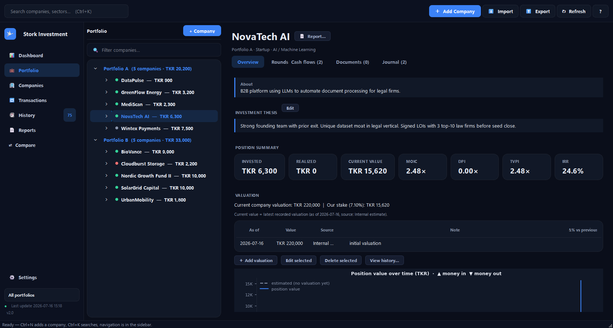
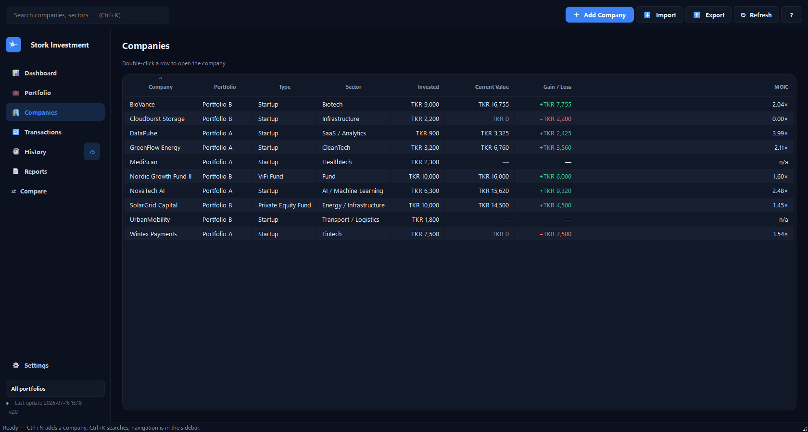
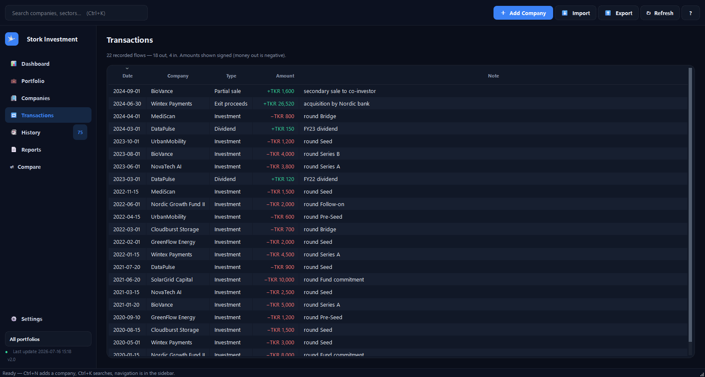

# Stork Investment

A desktop app for tracking investments in **private companies across funding rounds** —
built with PyQt6, SQLite and Matplotlib, for families and smaller investment groups who
hold illiquid, multi-round positions that a normal brokerage app can't represent.
The stork on the icon delivers the nest egg — and walks new users through the app.

Most portfolio tools assume public, liquid stocks with a live price. This one is built
for the opposite: a stake in a startup or fund bought across several rounds, where
"what's it worth now?" depends on the latest valuation, your ownership %, and a bit of
math (MOIC, IRR). The app keeps that history, does the math, and explains it in plain
language. All data stays **local** — nothing leaves your machine unless you explicitly
opt in to the AI assistant and approve each individual request.

> **Trying it out?** This project ships with fictional demo data.
> Run `python seed_demo_data.py` to populate the app with sample companies, then launch it.
> No real financial data is included in this repository.

---

## What this project demonstrates

A real, end-to-end desktop application covering:

- **Financial modelling in code** — date-true XIRR via a numerical solver (Newton's method with a bisection fallback), MOIC / DPI / RVPI / TVPI, ownership and dilution math, and portfolio time series **derived on demand** from dated valuations and cash flows (never stored snapshots that can go stale).
- **Trustworthy data layer** — a versioned SQLite migration runner that backs the database up before every migration, an append-only audit trail written in the same transaction as every change, and a single cash-flow ledger every metric reads from.
- **Desktop GUI engineering** — a sidebar-shell PyQt6 interface with a dashboard, read-only overview pages, tabbed company records, modal dialogs, embedded Matplotlib charts, and an animated first-run tour.
- **Report generation** — an as-of-correct report model rendered to portable single-file HTML and A4 PDF, with batch export.
- **Privacy-first AI integration** — an optional assistant that is off by default, shows the exact payload before anything is sent, validates every response against typed contracts, and never sees documents, file paths or API-key material.
- **Packaging** — a one-file PyInstaller executable so non-technical family members can run it with a double-click.

---

## Who is this for

- Family investment groups and angel/syndicate investors tracking private holdings
- Anyone holding positions across **multiple funding rounds** in the same company
- People who want **IRR / MOIC / gain-loss** without building a spreadsheet by hand

If you only hold listed stocks and ETFs, a regular brokerage app will serve you better.

---

## Screenshots

**Dashboard — portfolio value over time, key numbers, health checks, top holdings and a live activity rail**


**Company detail — position summary, valuation history with sources, and the position-value chart**


**Companies — a flat, sortable view of every holding**


**Transactions — the global cash-flow ledger, signed and color-coded**


---

## Guided tour

On first launch, the stork flies in and walks new users through the app —
it lands beside each key element, spotlights it, and explains it in plain language
in a speech bubble. Eight stops, under a minute, fully keyboard-navigable
(Enter/→ next, ← back, Esc exits), and it can be replayed anytime from the
**?** menu. If Windows' animation setting is off, the stork fades between stops
instead of flying. All figures below are fictional demo data.

**Welcome — the stork flies in and offers the tour**


**Stop 1: Getting around — the sidebar navigation**


**Stop 2: Portfolio value — the value-over-time chart and its metric tabs**


**Stop 3: The key numbers — invested, current value, gain and realized**


**Stop 4: Biggest holdings — the Top 5 card**


**Stop 5: Activity & alerts — recent changes and stale-valuation warnings**


**Stop 6: Reports — PDF/web reports for a company, an owner, or the whole portfolio**


**Stop 7: Add a company — where a new investment starts**


**Stop 8: AI assistant — optional and off by default; the stork points to where it lives**


---

## Features

**Dashboard**
- Portfolio-value chart with metric tabs (**Total Value / Gain-Loss / MOIC / IRR**) and 1M–ALL ranges, computed on demand from dated valuations and cash flows
- KPI cards — invested, known current value, gain/loss, realized, MOIC/TVPI — with plain-language tooltips
- **Portfolio Health** — valuation coverage, concentration risk, loss exposure and stale valuations as at-a-glance indicator bars
- Extended **Top 5 holdings** (ownership %, MOIC, sparklines) and a sector allocation donut
- Right rail: **Recent Activity** straight from the audit trail, one-click Quick Actions, and **Alerts** for valuations older than 12 months
- "Since last update" delta — what changed since your last session

**Navigation**
- Fixed sidebar (Dashboard / Portfolio / Companies / Transactions / History / Reports / Compare) with a live change-count badge
- Global search and a **Ctrl+K** type-ahead palette to jump to any company
- Read-only **Companies** table and a global signed **Transactions** ledger

**Per company**
- Tabbed record — Overview, Rounds & Cash flows, Documents, Journal
- **Valuation history** with dates, sources and notes — the current value is always the latest dated entry, never a hand-edited field
- Position-value chart with money-in/money-out markers; estimated stretches are drawn dashed and labeled
- Investment thesis, document attachments (per company or per round), and a dated journal
- Full **cash-flow ledger** per company: investments, follow-ons, dividends, partial sales, exits — every metric reads from these flows

**History & safety**
- Append-only **audit trail** of every change (view it globally or per company); it deliberately survives even a full wipe
- Automatic backups: before every schema migration (kept forever) and daily while you work (last 10 kept), plus one-file portable zip export of database + documents
- Danger zone: delete-everything requires typing DELETE and writes its own backup first

**Reports**
- Company, portfolio and per-owner reports — portable single-file HTML or A4 PDF
- Report Center with batch export (all companies / all owners) and progress
- As-of-correct: reports take a date and reconstruct the portfolio as it was
- Every metric footnoted with its assumptions

**Optional AI assistant (off by default)**
- Per-company **narratives** and structured **risk flags**, and a portfolio **Q&A** panel
- Every request shows a consent dialog with the **exact payload** before anything is sent — there is no "always allow"
- The AI sees only report-level figures: never documents, file names, paths or keys; an optional pseudonymization mode replaces company/owner names
- Works with a local Claude Code CLI or an OpenAI API key (stored DPAPI-encrypted, never in the database)
- Generated narratives are persisted with provenance and reused — exporting a report never silently calls an API

**Data in and out**
- **Excel import / export** — including a family-spreadsheet format with re-sync
- Portable backup zip to move or share the whole portfolio

---

## Tech stack

| Layer | Technology |
|---|---|
| UI | PyQt6 |
| Database | SQLite (Python `sqlite3`) |
| Charts | Matplotlib |
| Excel I/O | openpyxl |
| Packaging | PyInstaller |

---

## Getting started

### Prerequisites
- **Python 3.11+**
- Developed and packaged on Windows; the UI itself is cross-platform Qt

### Install and run

```bash
pip install -r requirements.txt
python seed_demo_data.py     # optional: load fictional sample companies
python main.py
```

On first launch the app creates an empty `investments.db` next to itself, and the
stork offers you the guided tour. Add a company manually, load the demo data above,
or use **Import** in the top bar to load a spreadsheet.

### Build a standalone executable

For family members who don't have Python installed, build a double-click app:

```bash
pip install pyinstaller
pyinstaller --onefile --windowed --icon app.ico --add-data "ui/assets;ui/assets" -n StorkInvestment main.py
```

The executable appears in `dist/`. The `--add-data` flag bundles the hero art, the
app icon and the tour's stork sprites. Build on the OS you're targeting — a Windows
`.exe` must be built on Windows.

---

## How the metrics work

- **MOIC / TVPI** = (current value + realized proceeds) ÷ total invested — e.g. `2.4×`
- **DPI** = realized proceeds ÷ invested (money actually returned); **RVPI** = remaining value ÷ invested
- **IRR** = annualised return from the *dates* of every cash flow plus the current value as a terminal assumption, so timing matters (money in early and up a lot beats the same gain over a decade)
- **Current value** = your ownership % × the company's latest dated valuation; ownership scales down after partial sales
- Exited or bankrupt companies count only what was actually received — their unrealized value is zero by definition
- Positions with no valuation yet are carried at net invested capital and clearly marked as estimates

Valuations are entered manually — the app doesn't fetch live prices, because private
companies don't have one. The Alerts rail warns you when valuations go stale.

---

## Excel import

The importer (`excel_io.py`) targets a **specific two-portfolio spreadsheet format** with yearly investment columns, where section headers indicate which portfolio a company belongs to. **If your spreadsheet differs, you'll need to adapt the parser** — start with the column-mapping section at the top of `excel_io.py`.

---

## Project structure

```
StorkInvestment/
├── main.py              # Entry point: icon, styles, boot, first-run tour
├── models.py            # SQLite layer: versioned migrations, audited CRUD
├── metrics.py           # MOIC/DPI/RVPI/TVPI, date-true XIRR, derived NAV series
├── backups.py           # Pre-migration + daily rotating backups
├── excel_io.py          # Excel import/export logic
├── formatting.py        # Shared money/date display formatting
├── resources.py         # PyInstaller-safe asset path resolution
├── version.py           # App name + version (quoted in report headers)
├── seed_demo_data.py    # Loads fictional demo data
├── reporting/           # Report pipeline: model → charts → HTML/PDF export
├── ai/                  # Optional AI: providers, contracts, consent, keystore
├── ui/                  # PyQt6 interface
│   ├── main_window.py        # Sidebar shell, top bar, shortcuts
│   ├── dashboard.py          # Dashboard tab (charts, KPIs, health, rail)
│   ├── companies_page.py     # Read-only all-companies table
│   ├── transactions_page.py  # Global signed cash-flow ledger
│   ├── detail_panel.py       # Company record (Overview/Rounds/Documents/Journal)
│   ├── tour.py               # First-run stork tour
│   ├── report_center.py      # Batch report export
│   ├── dialogs.py            # Add/edit dialogs, tabbed Settings
│   └── ...                   # Tree panel, quick jump, AI panels, styles
└── tests/               # pytest suite (temp databases only; network banned)
```

---

## Data & privacy

All data is stored locally in `investments.db` (SQLite). The database, documents and
backups are excluded from this repository via `.gitignore` — this public repo contains
only code and fictional demo data.

Nothing leaves your machine by default. The AI assistant is **opt-in and off until you
enable it**; when on, every single request shows you the exact data that would be sent
and waits for your approval. Documents, file names and paths are never included in any
payload, API keys are stored encrypted with Windows DPAPI outside the database, and the
app's own activity log records only sizes and outcomes — never content. Exported reports
reuse previously generated AI text; exporting never triggers a network call.

To move or share your data, use **Export → Export backup** to create a portable zip.

---

## Troubleshooting

- **`ModuleNotFoundError` on launch** → run `pip install -r requirements.txt` again, ideally inside a virtual environment.
- **Charts don't render** → confirm Matplotlib installed cleanly; on Linux you may also need a Qt platform plugin (`sudo apt install libxcb-cursor0`).
- **Excel import puts data in the wrong place** → your spreadsheet layout differs from the expected format; adjust the parser in `excel_io.py`.
- **Windows blocks the freshly built .exe** → unsigned new binaries trigger SmartScreen; choose "More info → Run anyway".

---

## License

MIT
